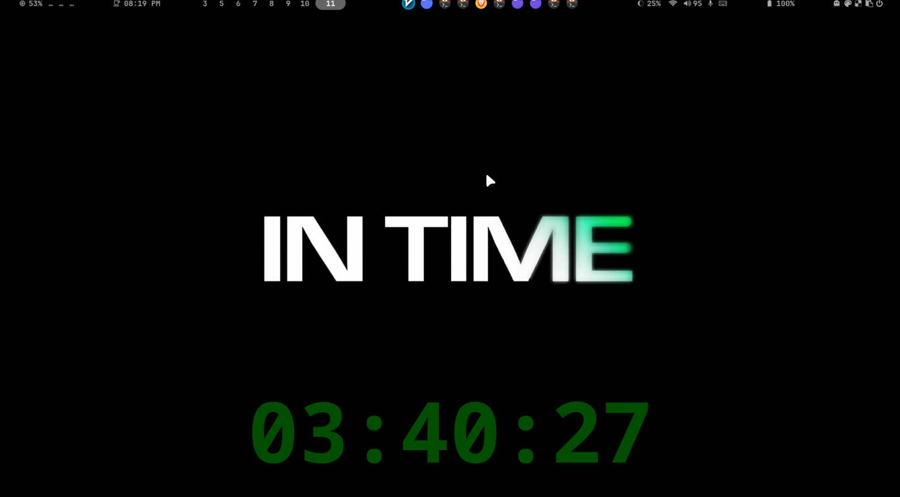
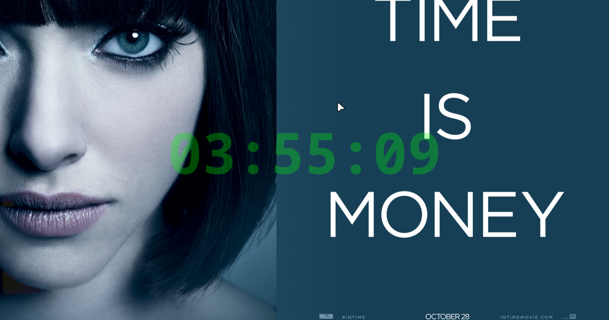
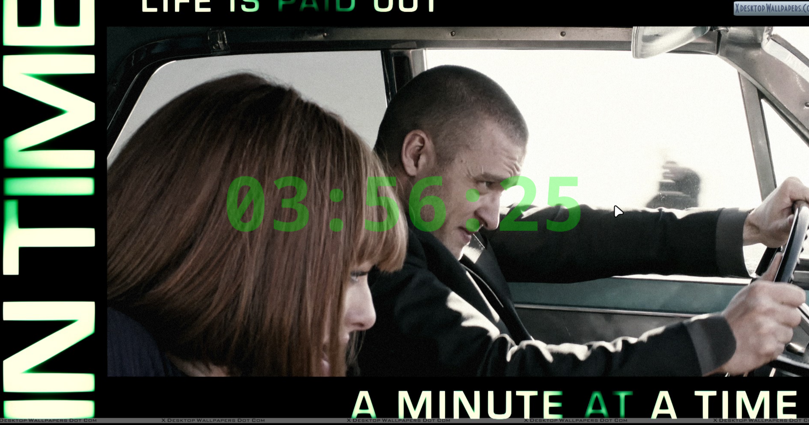
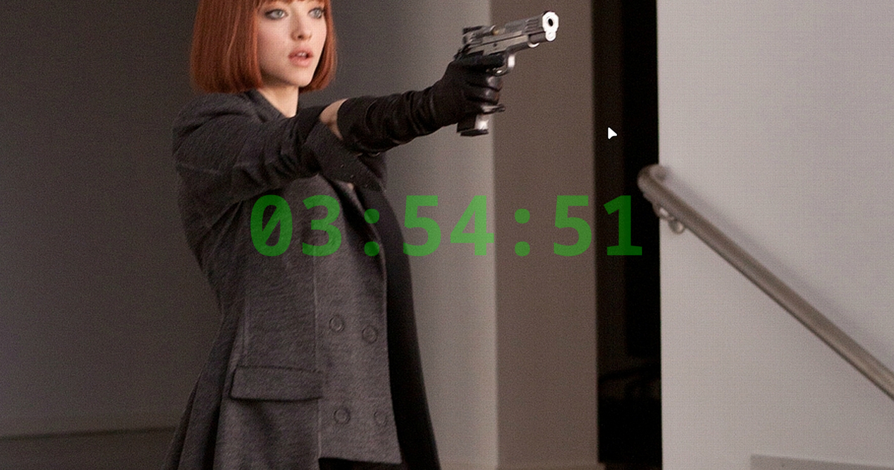

<div align="center">

# ⏱️ InTime Widget

### *Your time is running out. Make every second count.*

<p>
A Hyprland countdown widget inspired by the film <i>"In Time"</i> (2011)<br>
where time is currency and every second matters.
</p>


---

## 🎥 Demo

<!-- TODO: Add demo GIF here once created -->
<!-- Create a 30-second GIF showing: -->
<!-- - Widget startup and different modes (clock, countdown, deadline) -->
<!-- - Dynamic color changes in action -->
<!-- - Different position presets (top, center, bottom) -->
<!-- - Visual effects (lightbulb glow, deadline urgency) -->
<!-- Use: Peek, OBS, or SimpleScreenRecorder to capture -->
<!-- Optimize to <10MB using online tools like ezgif.com -->

> **Demo GIF coming soon!** In the meantime, check the [Screenshots](#-screenshots) section below.

</div>

---

## 🎬 The Concept

In the dystopian film *"In Time"* (2011), people stop aging at 25, but a glowing green countdown appears on their arm. When it hits zero, they die. Time becomes the ultimate currency - literally buying and selling years, hours, minutes.

**InTime Widget** brings this visceral time-awareness to your desktop. Unlike boring system clocks, InTime makes you *feel* time passing, creating a constant reminder that every second counts.

Perfect for:
- 🎯 **Deadline Warriors** - Visual countdown with progressive urgency effects
- 🧘 **Focus Sessions** - Pomodoro-style time tracking with purpose
- ⚡ **Time Hackers** - Constant awareness that time is your most valuable resource
- 🎨 **Aesthetic Lovers** - Beautiful green glow effects inspired by the film

---

## ✨ Features

### 🕐 Four Display Modes

<table>
<tr>
<td width="25%">

**⏰ Clock Mode**

Standard time display with seconds precision

```bash
20:45:33
```

</td>
<td width="25%">

**⏳ Countdown Mode**

Race against time with custom duration

```bash
00:29:47
```

</td>
<td width="25%">

**🌙 Midnight Mode**

Countdown to tomorrow

```bash
03:14:27
```

</td>
<td width="25%">

**💀 Deadline Mode**

Horror-style countdown with urgency effects

```bash
00:05:43
```
*Gets more intense as time runs out*

</td>
</tr>
</table>

### 🎨 Visual Styles

- **Normal** - Clean, bold monospace (like the movie's bio-clocks)
- **Lightbulb** - 3 Body Problem-inspired particle glow effect (15 layers)
- **Bordered** - Dark outline for maximum visibility

### 🔥 Unique Features

- **🚨 Forbidden Alarm** - Intense visual alarm (12-layer glow + waves + screen shake)
- **🎨 Dynamic Colors** - Real-time adaptive color based on screen content
- **🖥️ Multi-Monitor** - Display on one or all monitors simultaneously
- **👻 Click-Through** - Transparent overlay that never interferes
- **🔌 IPC Control** - 6 commands for remote control via Unix socket
- **⚡ Optimized** - Efficient rendering (3-20fps depending on mode)

---

## 📸 Screenshots

<table>
  <tr>
    <td width="50%">
      
      <p align="center"><b>Clean Desktop Integration</b><br>Transparent overlay, always visible, never intrusive</p>
    </td>
    <td width="50%">
      
      <p align="center"><b>Inspired by the Film</b><br>"Time is Money" - the ultimate currency</p>
    </td>
  </tr>
  <tr>
    <td width="50%">
      
      <p align="center"><b>Every Second Counts</b><br>Real-time countdown with green glow aesthetic</p>
    </td>
    <td width="50%">
      
      <p align="center"><b>High-Pressure Deadlines</b><br>Progressive urgency effects as time runs out</p>
    </td>
  </tr>
</table>

---

## 🚀 Quick Start

### Installation

```bash
# Clone the repository
git clone https://github.com/mathis0/InTime.git
cd InTime

# Install dependencies (Arch Linux)
sudo pacman -S gtk4 gtk4-layer-shell python python-gobject python-cairo

# Run interactive installer
./scripts/install.sh
```

**That's it!** The installer will guide you through configuration.

### Basic Usage

```bash
# Show current time with dynamic colors
intime-widget start

# 30-minute Pomodoro timer with sci-fi glow
intime-widget start --mode countdown --duration 30m --style lightbulb

# 1-hour deadline with horror effects (gets intense!)
intime-widget start --mode deadline --duration 1h

# Countdown to midnight on all monitors
intime-widget start --mode midnight --all-monitors

# Stop the widget
intime-widget stop
```

---

## 💡 The "In Time" Experience

### Why Time Awareness Matters

> *"For a few to be immortal, many must die."* - In Time (2011)

While we don't have countdown clocks on our arms (yet), InTime Widget serves a deeper purpose:

1. **Mortality Awareness** - Memento mori for the digital age
2. **Productivity Boost** - Deadlines create urgency and focus
3. **Time as Currency** - Every hour you spend is an hour you can't get back
4. **Visual Accountability** - Can't ignore time when it's always visible

Unlike the dystopian film where time inequality creates class warfare, InTime Widget democratizes time awareness - everyone gets the same countdown.

---

## 📖 Usage Guide

### Command-Line Options

```bash
./src/intime_widget.py [OPTIONS]

Display Modes:
  --mode clock          Standard time display (default)
  --mode countdown      Timer with custom duration
  --mode midnight       Countdown to end of day
  --mode deadline       Horror-style countdown with urgency

Countdown Options:
  --duration DURATION   e.g., 30m, 1h30m, 2h15m30s

Visual Options:
  --style normal        Clean bold text (default)
  --style lightbulb     Particle glow effect
  --color "#RRGGBB"     Fixed color (disables dynamic colors)
  --opacity 0.0-1.0     Transparency level
  --font-size SIZE      Text size in pixels

Position Options:
  --position top        Top of screen
  --position center     Center (default)
  --position bottom     Bottom of screen
  --position-x X --position-y Y   Custom coordinates

Monitor Options:
  --monitor INDEX       Specific monitor (0=primary, 1=secondary)
  --all-monitors        Display on all monitors
```

### Examples

```bash
# Pomodoro timer (25 min work session)
intime-widget start --mode countdown --duration 25m --style lightbulb

# Urgent deadline at top of screen
intime-widget start --mode deadline --duration 2h --position top --color "#FF0000"

# Always-on clock at bottom with dynamic colors
intime-widget start --position bottom

# Meeting countdown on secondary monitor
intime-widget start --mode countdown --duration 1h --monitor 1
```

### Control Commands (IPC)

```bash
# Reload configuration
echo "reload_config" | nc -U /tmp/intime_widget.sock

# Get widget status
echo "status" | nc -U /tmp/intime_widget.sock

# Trigger forbidden alarm (urgent notification)
echo "forbidden_alarm:Emergency|Critical Task|Time is up!" | nc -U /tmp/intime_widget.sock

# Dismiss alarm
echo "dismiss_alarm" | nc -U /tmp/intime_widget.sock

# Reset from deadline mode to clock
echo "reset_deadline" | nc -U /tmp/intime_widget.sock

# Toggle screen color sampling on/off
echo "toggle_screen_sampling" | nc -U /tmp/intime_widget.sock
```

See [IPC_COMMANDS.md](IPC_COMMANDS.md) for complete documentation.

---

## ⚙️ Configuration

Edit `~/.config/intime/config.json` to customize defaults:

```json
{
  "color": "#00FF00",
  "font_size": 78,
  "style": "normal",
  "opacity": 0.5,
  "position_mode": "preset",
  "position_preset": "center",
  "screen_sampling": {
    "enabled": true,
    "update_interval": 0.5,
    "throttle_threshold": 15
  },
  "background_color": "#000000"
}
```

**Position presets:** `top`, `center`, `bottom`
**Styles:** `normal`, `lightbulb`

All settings can be overridden via command-line arguments.

---

## 🏗️ Architecture

### Production-Ready Code

- **1,338 lines** of polished Python
- **GTK4 + Layer Shell** for proper Wayland overlays
- **Cairo rendering** for pixel-perfect graphics
- **IPC server** for remote control
- **Multi-monitor** support via monitor detection
- **Adaptive colors** with screen sampling

### Key Components

| Component | Lines | Purpose |
|-----------|-------|---------|
| `IPCServer` | 38-131 | Unix socket for remote control |
| `InTimeWidget` | 227-1192 | Main widget, rendering, animations |
| `ScreenColorMonitor` | (separate file) | Real-time screen sampling |
| `InTimeApplication` | 1194-1251 | GTK app wrapper, multi-monitor |

### Rendering Pipeline

1. **Mode calculation** - Determine current time/countdown value
2. **Color processing** - Parse config/CLI color, apply dynamic sampling
3. **Style routing** - Normal/Lightbulb/Bordered/Deadline renderers
4. **Animation system** - 1Hz clock, 20Hz lightbulb, 3Hz deadline, 10Hz alarm

### Performance

- **Optimized layer counts** - All visual effects tuned for efficiency
- **Variable frame rates** - 1-20fps depending on visual complexity
- **Low CPU usage** - Deadline mode uses only 3fps
- **GPU acceleration** - Cairo uses hardware rendering when available

---

## 🎯 Why InTime Widget?

### The Problem

Standard desktop clocks are boring. They show time, but they don't make you *feel* time passing. You glance, see "14:30", and move on. No urgency. No awareness. No connection to the ticking clock of your life.

### The Solution

InTime Widget transforms time display into an **experience**:

- **Visceral countdown** - Watch seconds tick away in real-time
- **Progressive urgency** - Deadline mode gets more intense as time runs out
- **Always visible** - Transparent overlay you can't ignore
- **Beautiful aesthetics** - Green glow inspired by the film's bio-clocks

### The Philosophy

> "Time is the most valuable thing a man can spend." - Theophrastus

InTime Widget embodies **Memento Mori** (remember you must die) for the digital age. By making time visible and urgent, it encourages:

- **Intentional living** - Awareness of how you spend each hour
- **Productivity** - Deadlines create focus and eliminate procrastination
- **Time appreciation** - Recognizing that every second is precious

In the movie, the poor live day-by-day with minutes remaining. The rich have centuries. InTime Widget reminds us that *everyone* is on the clock - the only question is how you spend your time.

---

## ❓ FAQ

<details>
<summary><b>How do I record a demo GIF of the widget?</b></summary>

Use **Peek** (recommended for Linux):
```bash
sudo pacman -S peek  # Arch Linux
peek
```
Click the Peek window, position it over your widget, and click Record. Optimize the GIF with [ezgif.com](https://ezgif.com/optimize) to reduce file size.

</details>

<details>
<summary><b>Why is the widget not showing up?</b></summary>

1. Ensure you're running Hyprland (not X11)
2. Check if GTK4 layer shell is installed: `pacman -Q gtk4-layer-shell`
3. Try running with verbose output: `intime-widget start --help`
4. Check if another instance is running: `intime-widget status`

</details>

<details>
<summary><b>Can I use this with Waybar or Eww?</b></summary>

InTime Widget is a **standalone overlay widget**, not a Waybar/Eww module. It runs independently and displays on top of everything. However, you can:
- Use IPC commands to control it from Waybar buttons
- Position it to avoid overlapping with your bar
- Use the same color scheme for visual consistency

</details>

<details>
<summary><b>How do I make the widget auto-start with Hyprland?</b></summary>

Add to your `~/.config/hypr/hyprland.conf`:
```conf
exec-once = intime-widget start --mode clock --position bottom
```

Or for a Pomodoro timer that restarts daily:
```conf
exec-once = intime-widget start --mode countdown --duration 25m --style lightbulb
```

</details>

<details>
<summary><b>What's the difference between "countdown" and "deadline" modes?</b></summary>

- **Countdown**: Clean timer that decreases in HH:MM:SS format. Great for Pomodoro sessions.
- **Deadline**: Horror-style countdown with progressive urgency effects (pulsing, color shifts, intensity increases as time runs out). Use when you need extra motivation!

</details>

<details>
<summary><b>Does dynamic color mode work on Wayland?</b></summary>

Yes! It uses `grim` (Wayland screenshot tool) to sample your screen colors every 0.5 seconds. Install with:
```bash
sudo pacman -S grim
```

If you prefer fixed colors, use `--color "#00FF00"` which automatically disables dynamic sampling.

</details>

<details>
<summary><b>How much CPU/RAM does it use?</b></summary>

Very minimal:
- **RAM**: ~30-50 MB
- **CPU**: <1% idle, 2-3% during animations
- **Frame rates**: 1fps (clock), 3fps (deadline), 20fps (lightbulb)

The widget is optimized for efficiency - even intensive visual effects use low frame rates.

</details>

<details>
<summary><b>Can I customize the colors/fonts/size?</b></summary>

Yes! Via command-line arguments:
```bash
intime-widget start --color "#FF00FF" --font-size 120 --opacity 0.8
```

Or edit `~/.config/intime/config.json` for persistent defaults.

</details>

<details>
<summary><b>Does this work on non-Hyprland Wayland compositors?</b></summary>

It should work on any compositor that supports `gtk4-layer-shell` (Sway, River, etc.), but it's **only tested on Hyprland**. Try it and report back!

</details>

<details>
<summary><b>How do I contribute color themes or presets?</b></summary>

1. Fork the repo
2. Add your theme to `config/themes/` directory
3. Include a screenshot
4. Submit a PR with description

Popular themes (Matrix green, Nord, Dracula, Catppuccin) are especially welcome!

</details>

---

## 🤝 Contributing

Contributions are welcome! Please read [CONTRIBUTING.md](CONTRIBUTING.md) for guidelines.

### Quick Links

- 🐛 [Report a Bug](https://github.com/mathis0/InTime/issues/new?labels=bug&template=bug_report.md)
- ✨ [Request a Feature](https://github.com/mathis0/InTime/issues/new?labels=enhancement&template=feature_request.md)
- 📖 [Documentation](https://github.com/mathis0/InTime/wiki)

---

## 📚 Additional Resources

- **[QUICKSTART.md](QUICKSTART.md)** - Fast setup guide
- **[IPC_COMMANDS.md](IPC_COMMANDS.md)** - Complete IPC reference
- **[CHANGELOG.md](CHANGELOG.md)** - Version history
- **[CONTRIBUTING.md](CONTRIBUTING.md)** - Contribution guidelines

---

## 📜 License

MIT License - See [LICENSE](LICENSE) for details

---

## 🎬 Credits

**InTime Widget** is inspired by:
- **"In Time" (2011 film)** - Directed by Andrew Niccol
- **Hyprland community** - For the amazing Wayland compositor
- **GTK4 Layer Shell** - For proper overlay support

Created with the philosophy that **time is the ultimate currency** and every second should be spent intentionally.

---

<div align="center">

### ⏱️ Don't waste your time. Track it.

**[⭐ Star this repo](https://github.com/mathis0/InTime)** if you believe time matters.

*Made with urgency for the time-conscious*

</div>
